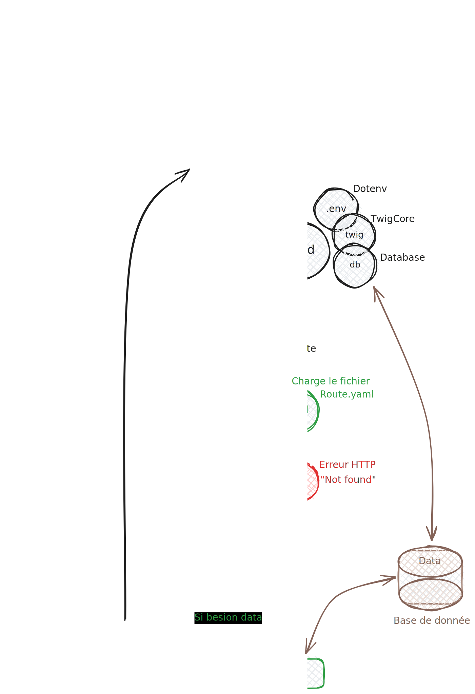

# Comment faire un controller ?

Pour créer un controller, vous pouvez utiliser la commande "edu" à la racine de votre projet. 

Vous pouvez l'utiliser à la racine de votre projet en tapant la commande suivante :

```Shell
php bin/edu make:controller NOM_DU_CONTROLLER
```

# Exemple de création d'un controller

```Shell
php bin/edu make:controller Hello
```

### Le fichier HelloController.php
Cette commande va créer un fichier "HelloController.php" dans le dossier "src/Controller". 

```php 
<?php

namespace Controller;

use Studoo\EduFramework\Core\Controller\ControllerInterface;
use Studoo\EduFramework\Core\Controller\Request;
use Studoo\EduFramework\Core\View\TwigCore;
use Twig\Error\LoaderError;
use Twig\Error\RuntimeError;
use Twig\Error\SyntaxError;

class HelloController implements ControllerInterface
{
	public function execute(Request $request): string|null
	{
		return TwigCore::getEnvironment()->render('hello/hello.html.twig',
		    [
		        "titre"   => 'HelloController',
		        "request" => $request
		    ]
		);
	}
}
```

On peut voir que le controller HelloController implémente l'interface ControllerInterface. 

La méthode execute prend en paramètre un objet de type Request et retourne une chaine de caractère ou null.

!!! info

    Pour aller plus loin, vous pouvez lire la documentation de la classe Request pour comprendre comment gérer les requêtes HTTP.


### Le fichier hello.html.twig
Et va aussi créer un fichier "hello.html.twig" dans le dossier "src/Template/hello".

```twig


{{ titre }}


    <h1>{{ titre }}</h1>

```

## Modifier le fichier des routes
Et modifier le fichier des routes "config/routes.yaml" pour ajouter la route de votre controller.

```yaml
hello:
  uri: /hello
  controller: Controller\HelloController
  httpMethod: [GET]
```

Vous pouvez accéder à votre controller en tapant l'url suivante : [http://localhost:8042/hello](http://localhost:8042/hello){:target="_blank"}

Vous pouvez modifier le fichier des routes "config/routes.yaml" pour changer l'url de votre controller.
Remplacer "/hello" par "/bonjour" par exemple.

```diff
hello:
-  uri: /hello
+  uri: /bonjour
  controller: Controller\HelloController
  httpMethod: [GET]
```
Vous pouvez accéder à votre controller en tapant l'url suivante : [http://localhost:8042/bonjour](http://localhost:8042/bonjour){:target="_blank"}

## Schema pour comprendre le fonctionnement pour aller vers controller

<figure markdown="span">

</figure>