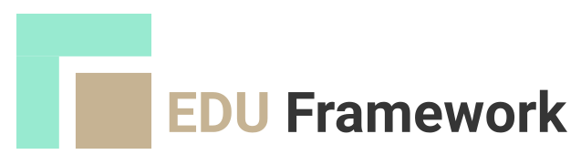

# Light Education PHP framework

<figure markdown="span">
  { width="500" }
</figure>
    
Le projet "Edu Framework" vise à répondre à une problématique récurrente identifiée lors de nos formations : "Comment faire une transition vers un framework comme Symfony ? »

L'objectif principal "Edu Framework" est de fournir un ensemble d'outils, de guides et de ressources pédagogiques permettant aux développeurs, qu'ils soient novices ou expérimentés, de faciliter la transition vers un framework comme Symfony. Ce projet visera à couvrir les aspects fondamentaux, en mettant l'accent sur les meilleures pratiques de développement.

!!! warning "Information importante"

    **Ce framework n'est pas adapté à une utilisation en production. Il est destiné à des fins pédagogiques.**

    [](https://app.codacy.com/gh/studoo-app/edu-framework/dashboard?utm_source=gh&utm_medium=referral&utm_content=&utm_campaign=Badge_grade){:target="_blank"}
    [](https://app.codacy.com/gh/studoo-app/edu-framework/dashboard?utm_source=gh&utm_medium=referral&utm_content=&utm_campaign=Badge_coverage){:target="_blank"}
    [](https://www.codefactor.io/repository/github/studoo-app/edu-framework){:target="_blank"}
    [](https://packagist.org/packages/studoo/edu-framework){:target="_blank"}
    [](https://packagist.org/packages/studoo/edu-framework){:target="_blank"}
    [](https://packagist.org/packages/studoo/edu-framework){:target="_blank"}

## Démarrage rapide

Pour créer un nouveau projet Edu Framework, vous pouvez utiliser la commande suivante :
```bash
composer create-project studoo/edu-framework my_project_name 2.x-dev
```

Se rendre dans le dossier du projet :
```bash
cd my_project_name
```

Pour démarrer le serveur de développement, vous pouvez utiliser la commande suivante :
```bash
php bin/edu start
```

Cette commande va démarrer le serveur de développement à l'adresse [http://localhost:8042](http://localhost:8042){:target="_blank"}.

## Etat des pipelines de développement

L'état des pipelines de développement est disponible :

| Package                     | Release | Github actions                                                                                                      |
|:----------------------------|:--------|:--------------------------------------------------------------------------------------------------------------------|
| Edu Framework stable        | main    |  |
| Edu Framework v2            | v2.x    |   |
| Edu Framework documentation | main    |                 |
