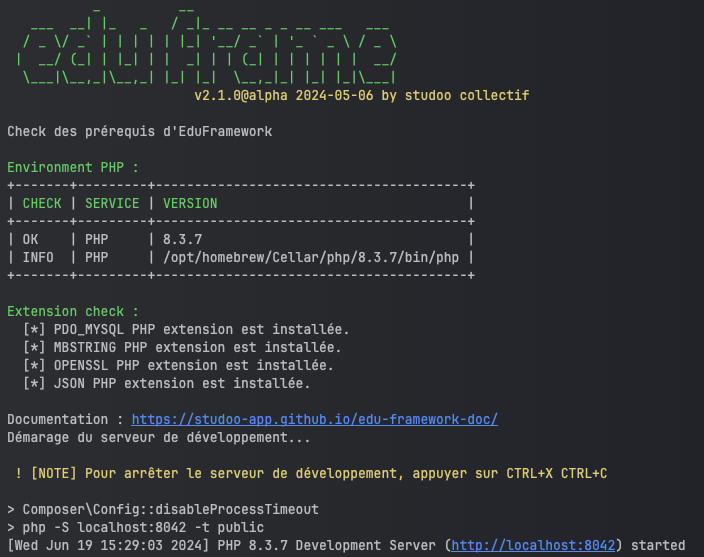

# La commande bin/edu

Nous avons mise en place une commande pour faciliter les taches. Cette commande est appelée "edu".
Vous pouvez l'utiliser à la racine de votre projet en tapant la commande suivante :

```Shell
php bin/edu 
```

!!! info "Exemple de commande"

    Voici un exemple, pour démarrer l'application, vous pouvez taper la commande suivante

    ```Shell
    php bin/edu start
    ```

    Ce résultat est un exemple et il ne sera probablement pas le vôtre.

    <figure markdown="span">
    
    </figure>

Pour voir les commandes disponibles, vous pouvez taper la commande suivante :

```Shell
php bin/edu list
``` 

Voici les commandes disponibles par version :

| Composants      | Description                                   | A partir de la version |
|-----------------|-----------------------------------------------|------------------------|
| start           | pour démarrer l'application                   | v1.2                   |
| list            | pour lister les commandes disponibles         | v1.2                   |
| check:config    | check la configuration de votre environnement | v1.2                   |
| make:controller | génération d'un controller                    | v1.0                   |
| make:api        | génération d'un controller type json API      | v2.0                   |
| make:command    | génération d'un commande line                 | v2.0                   |

___

## Si vous rencontrez une erreur

### Command no found

Si vous avez une erreur pour utiliser la commande "edu", vous pouvez l'installer avec les commandes suivantes :

=== ":fontawesome-brands-windows: WINDOWS"

    Pour installer la commande "edu", suivre les instructions :

    Ouvrir un terminal git bash à la racine de votre projet
    
    ```bash
    mkdir bin && curl -o bin/edu https://raw.githubusercontent.com/studoo-app/edu-framework/main/bin/edu
    ```

    !!! bug "curl: (35)"

        Si vous rencontrez une erreur `curl: (35) schannel: next InitializeSecurityContext failed: Unknown error (0x80092012) - The revocation function was unable to check revocation for the certificate.`
    
        Saisir la commande suivante :

        ```bash
        curl --ssl-no-revoke -o bin/edu https://raw.githubusercontent.com/studoo-app/edu-framework/main/bin/edu
        ```

=== ":fontawesome-brands-apple: MAC OS"

    Pour installer la commande "edu", suivre les instructions :

    Ouvrir un terminal à la racine de votre projet

    ```bash
    mkdir bin && curl -sS https://raw.githubusercontent.com/studoo-app/edu-framework/main/bin/edu -o bin/edu
    ```

