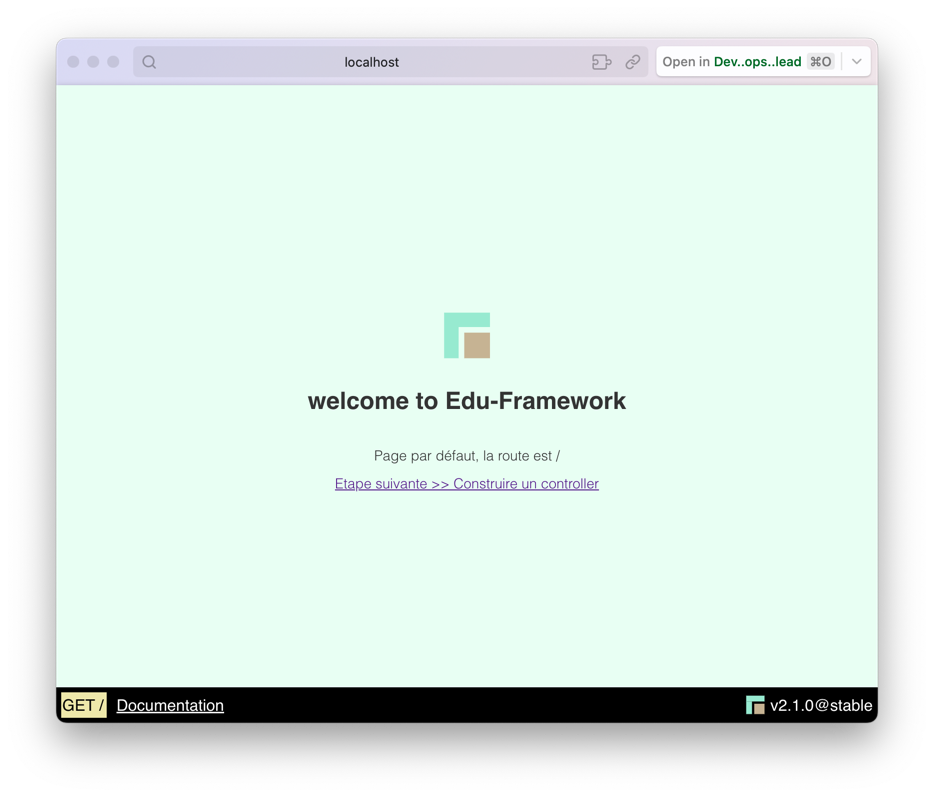

# Start/Stop l'application

## Démarrez l'application

Pour démarrer l'application, il suffit ouvrir un terminal :

=== ":octicons-terminal-16: Via Edu CLI"

    Si vous avez la dernière version v2.x ou supérieur, le démarrage se passe avec la commande suivante :

    ```bash
    php bin/edu start
    ```

=== ":octicons-terminal-16: Via composer"

    Si vous avez la version v1.1 et inférieur, le démarrage se passe avec la commande suivante :
    
    ```bash
    composer edu:start
    ```

=== ":octicons-terminal-16: Mode natif"
    
    Si vous êtes au niveau de la racine de votre projet, vous pouvez démarrer l'application avec la commande suivante

    ```bash
    php -S localhost:8042 -t public
    ```

Voici un exemple de résultat de la ligne de commande :

<figure markdown="span">

</figure>

Voici un exemple de résultat de la page web :

<figure markdown="span">

</figure>

!!! info "Adresse de l'application"

    Cette commande va démarrer le serveur de développement à l'adresse [http://localhost:8042](http://localhost:8042){:target="_blank"}.


## Arrêtez l'application

Pour arrêter l'application, il suffit ouvrir le terminal où vous avez démarré l'application et appuyer sur les touches `CTRL + C`.

___

## Problème de démarrage

```bash
Failed to listen on localhost:8042 (reason: Address already in use)
```

Cette erreur vient que le port d'écoute (socket) 8042 est déjà utilisé (ou mal fermé)
Pour résoudre cette erreur, vous pouvez "killer" le processus attaché au port d'écoute.


=== ":fontawesome-brands-windows: WINDOWS"

    Sous Windows, la commande pour tuer le processus lié au port 8042 est légèrement différente. Voici comment vous pouvez le faire :
    
    ```bash
    FOR /F "tokens=5" %P IN ('netstat -a -n -o ^| findstr :8042') DO TaskKill.exe /F /PID %P
    ```
    
    Cette commande fonctionne en deux parties :
    
    1. `netstat -a -n -o ^| findstr :8042` : Cette commande liste tous les processus utilisant le port 8042.
    2. `TaskKill.exe /F /PID %P` : Cette commande utilise le PID extrait pour tuer le processus.

=== ":fontawesome-brands-apple: MAC OS"

    La commande pour tuer le processus lié au port 8042 sur macOS est la suivante :

    ```bash
    lsof -i :8042 | awk 'NR!=1 {print $2}' | xargs kill -9
    ```
    
    Cette commande fonctionne en trois parties :
    
    1. `lsof -i :8042` : Cette commande liste tous les processus utilisant le port 8042.
    2. `awk 'NR!=1 {print $2}'` : Cette commande extrait le numéro de processus (PID) de la sortie de la commande précédente.
    3. `xargs kill -9` : Cette commande utilise le PID extrait pour tuer le processus.


