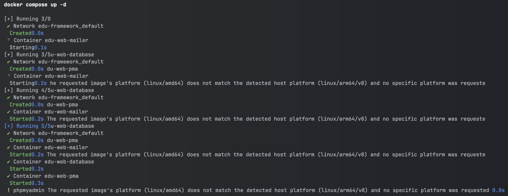
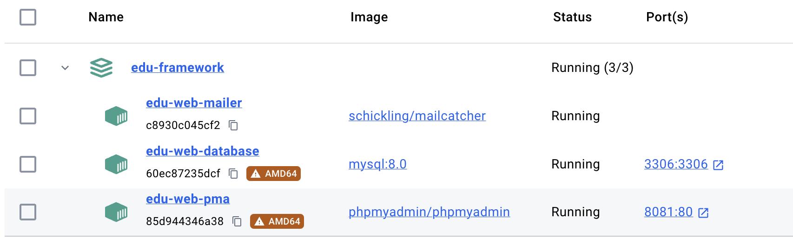

# Comment installer et gérer les services ?

Edu Framework utilise plusieurs services pour fonctionner. Pour les installer, vous avez deux possibilités :
    
- [Utiliser Docker pour émuler les services](#utiliser-docker-pour-emuler-les-services)
- [Installer les services directement sur votre machine](#utiliser-docker-pour-emuler-les-services)


## Utiliser Docker pour émuler les services

!!! info "Docker Desktop"
    Pour utiliser Docker, vous devez installer Docker Desktop sur votre machine. 
    Vous pouvez télécharger Docker Desktop sur le site officiel : [Docker Desktop](https://www.docker.com){:target="_blank"}

Démarrer Docker Desktop sur votre machine puis :

=== "Actuellement à partir de la version 2.0"

    Pour installation et démarrer des services, vous pouvez suivre les instructions suivantes :

    ```bash
    docker compose up -d
    ```

    Pour arrêter les services, vous pouvez suivre les instructions suivantes :

    ```bash
    docker compose down
    ```

=== "Jusqu'en version 1.2"

    Pour utiliser Docker pour émuler les services, vous pouvez suivre les instructions suivantes :
    
    ```bash
    composer edu:init
    ```

    Puis taper la commande suivante pour démarrer les services :

    ```bash
    composer edu:docker:db-service:start mysql
    ```

    Pour arrêter les services, vous pouvez suivre les instructions suivantes :

    ```bash
    composer edu:docker:db-service:stop mysql
    ```

La commande de démarrage des services peut varier en fonction de la version de docker, voici un exemple :

<figure markdown="span">

</figure>

Une fois les services démarrés, vous pouvez accéder au service via docker desktop ou via le terminal. Voici un exemple : 

<figure markdown="span">

</figure>

Les services sont prêts à être utilisés. Vous pouvez maintenant démarrer votre application Edu Framework. Les services sont disponibles sur les ports suivants :

| Composants                                                    | Socket (port d'écoute) | URL                                            | Version   |
|---------------------------------------------------------------|------------------------|------------------------------------------------|-----------|
| :simple-mysql: [MySQL](https://hub.docker.com/_/mysql){:target="_blank"}                                      | 3306                   | 127.0.0.1:3306                                 | Mysql 8.0 |
| :simple-phpmyadmin: [PHPMyAdmin](https://www.phpmyadmin.net/){:target="_blank"} | 8081                   | [http://127.0.0.1:8081](http://127.0.0.1:8081){:target="_blank"} | PMA 5.2.x |
| :simple-minutemailer: [Mailcatcher](https://mailcatcher.me/){:target="_blank"}  | 1025                   | [http://127.0.0.1:1080](http://127.0.0.1:1080){:target="_blank"} | latest |

!!! info 
    
    Pour accéder à PHPMyAdmin, vous pouvez utiliser les identifiants suivants :
    
    - Utilisateur : `root`
    - Mot de passe : `studoo`
    - Base de données par défaut : `app_db`

Vous pouvez également accéder à la base de données MySQL via un client SQL comme [DBeaver](https://dbeaver.io/){:target="_blank"} ou [MySQL Workbench](https://www.mysql.com/products/workbench/){:target="_blank"}.

## Installer les services sur votre machine

La deuxième solution est d'installer les services directement sur votre machine pour émuler les services. Pour faciliter l'installation et la configuration, vous pouvez utiliser des services comme MAMP, XAMPP...

Pour installer les services sur votre machine, vous pouvez installer les services suivants :


| Composants      | OS compatible                                                                      | URL                                                                    | Recommandation                                                                                                         |
|-----------------|------------------------------------------------------------------------------------|------------------------------------------------------------------------|------------------------------------------------------------------------------------------------------------------------|
| XAMPP | :fontawesome-brands-windows: :fontawesome-brands-apple: :fontawesome-brands-linux: | [https://www.apachefriends.org/fr](https://www.apachefriends.org/fr){:target="_blank"}                                  | :octicons-star-fill-16: :octicons-star-fill-16: :octicons-star-fill-16: :octicons-star-fill-16: :octicons-star-fill-16: |
| MAMP           | :fontawesome-brands-windows: :fontawesome-brands-apple:                            | [https://www.mamp.info](https://www.mamp.info){:target="_blank"}                         | :octicons-star-fill-16: :octicons-star-fill-16: :octicons-star-fill-16: :octicons-star-16: :octicons-star-16:          |
| WAMP            | :fontawesome-brands-windows:                                                       | [https://wampserver.aviatechno.net](https://wampserver.aviatechno.net){:target="_blank"} | :octicons-star-fill-16: :octicons-star-16: :octicons-star-16: :octicons-star-16: :octicons-star-16:                    |
| LAMP   | :fontawesome-brands-ubuntu:                                                        | [https://doc.ubuntu-fr.org/lamp](https://doc.ubuntu-fr.org/lamp){:target="_blank"}       | :octicons-star-fill-16: :octicons-star-fill-16: :octicons-star-16: :octicons-star-16: :octicons-star-16:           |


Cette liste n'est pas exhaustive et peut être amenée à évoluer. 

!!! info "Information importante"
    
    Nous vous recommandons d'utiliser Docker pour émuler les services. 

    Cela vous permettra de gagner du temps et de simplifier le processus de développement.
    Installer les services directement sur votre machine peut être plus complexe et plus long. Il fige également les versions des services installés.
    Ce qui peut poser des problèmes de compatibilité avec les versions utilisées par le framework.
