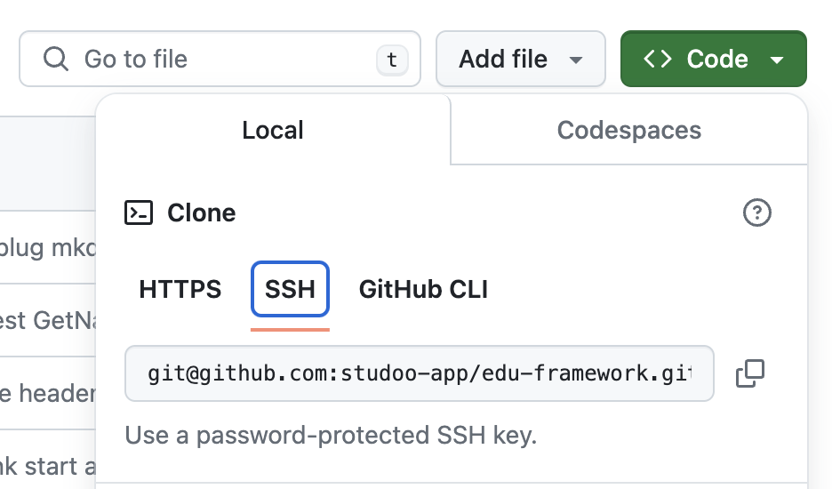

# Comment versionner votre projet ?

Pour travailler en mode projet, il est important de versionner son travail. Même tout seul ! :smile:

Les raisons sont simples :

- Revenir en arrière en cas de mauvaise manip et d'implémentation foireuse
- Avoir plusieurs versions de test, stable…
- Gestion des issues (taches)

Néanmoins, il n'est pas obligatoire de versionner votre projet. C'est un plus pour vous (compétence pro).

## Prérequis

Vous devez en amont avoir : 

- un compte chez votre fournisseur GIT
    - [:simple-github: Github](https://github.com)
    - [:simple-gitlab: GitLab](https://gitlab.com)
    - [:simple-bitbucket: Bitbucket](https://bitbucket.org)
    - [:simple-gitea: Gitea](https://gitea.io/fr-fr)
    - [:simple-git: Gogs](https://gogs.io)
    - [:simple-codeberg: Codeberg](https://codeberg.org)
- Avoir GIT installé sur votre machine
    - [:simple-git: Gestionnaire des versions](prerequis.md#gestionnaire-des-versions)

## Pour versionner le projet :

1/ Créez un nouveau dépôt vide (repository) chez votre fournisseur GIT (Github, GitLab ...)

!!! warning "Information importante"
    
     Veuillez noter que le repository doit être VIDE au moment de la création.
     Si ce n'est pas le cas, vous aurez des problèmes pour envoyer vos fichiers.

2/ Ouvrez un terminal et allez dans à la racine du projet

3/ Tapez les lignes suivantes :

- Initialisation du projet

````Bash
git init
````

- Ajout de l'URL du dépôt (repository) GIT (HTTPS ou SSH)

!!! warning "Information importante"
    
    Remplacez **URL_GIT_REPO** par le URL du repository lors sa création

    Copier URL qui se trouve dans le service GIT du repository

    Voici un exemple :

    ```bash
    git remote add origin git@github.com:studoo-app/edu-framework.git
    ```

    Un exemple et il ne sera probablement pas le vôtre. Ici nous avons selectionner le protocole SSH pour faire le lien avec le repository. Vous pouvez aussi utiliser le protocole HTTPS.
    Le SSH est plus sécurisé et plus rapide que le HTTPS. Néanmoins, il nécessite une configuration supplémentaire sur la machine avec l'installation d'une clé SSH.
    Exemple de configuration SSH : [Github SSH](https://docs.github.com/fr/authentication/connecting-to-github-with-ssh/adding-a-new-ssh-key-to-your-github-account){:target="_blank"}

    <figure markdown="span">
    {width="500"}
    </figure>


````Bash
git remote add origin URL_GIT_REPO
````

- Ajout de la branche "main"

````Bash
git branch -M main
````

- Ajout des fichiers pour le commit

````Bash
git add * .gitignore .env.example
````

- Ajout du commit 'init project'

````Bash
git commit -m 'init project'
````

- Envoi des fichiers local sur le dépôt (repository) distant

````Bash
git push -u origin main
````

## Erreur de push

Si vous avez des erreurs lors du push, voici quelques commandes pour vous aider :

Afficher les URL des dépôts (repository) GIT configurés dans votre projet :

````Bash
git remote show origin
````

Pour effacer URL de l'origine (origin) qui est déjà configurée dans votre GIT :
````Bash
git remote rm origin
````

